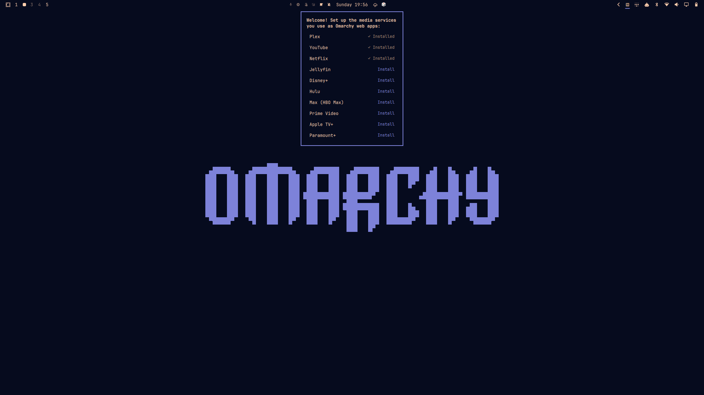
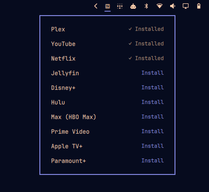
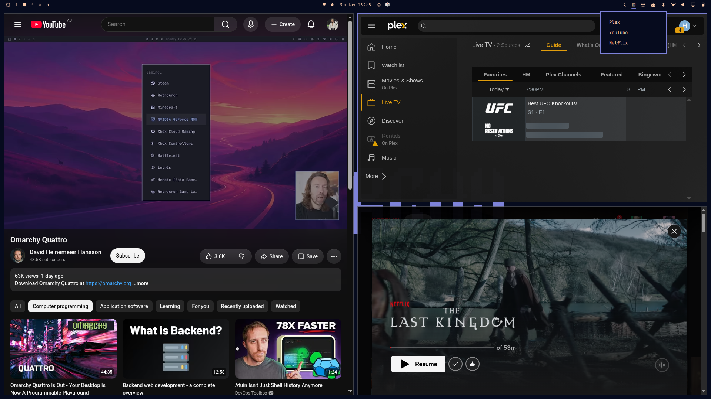
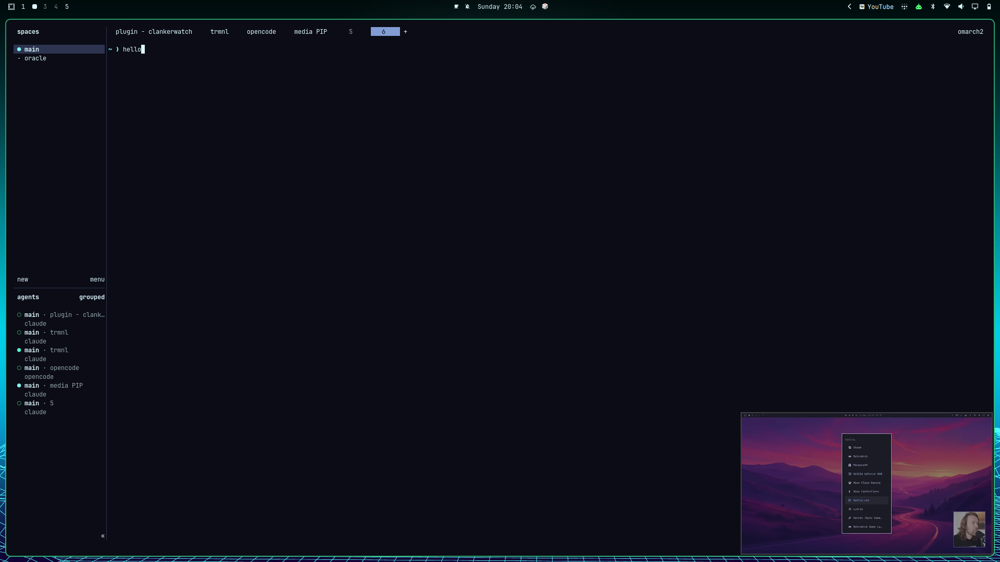

# omarchy-media-pip

Streamlines your media streaming setup on Omarchy with one-click
Omarchy web apps for Plex, YouTube, Netflix, and the rest of your
streaming services — then lets you float any of them into a corner as
picture-in-picture whenever you want them out of the way.

The setup half is what makes the rest painless: set up all your streaming
web apps from one place, then every source you've added is available as
PiP with a click. Right-click the bar icon any time for the same checklist
across every configured source. The PiP half does what it says: float,
pin, and corner-snap any configured source's window to a few fixed sizes,
with a real Quickshell bar icon and hotkeys (see `sources.json` for the
ten sources it ships with).

## Screenshots

**First run.** A one-time welcome popup offers to set up the media
services you use as proper Omarchy web apps — never shown again once
dismissed.



**Manage sources, any time.** Right-click the bar icon for the same
checklist — installed services show a checkmark, everything else is a
one-click install.



**Multiple sources at once.** With more than one source's window open,
clicking the bar icon asks which to PiP instead of guessing — shown here
with YouTube tiled, the Plex/YouTube/Netflix picker open top-right, and
Netflix already floating as PiP bottom-right.



**Out of your way.** PiP sits in the corner while you work — here running
alongside a terminal session, well clear of anything else on screen.



## Install

```bash
omarchy plugin add https://github.com/haydenmckay/omarchy-media-pip.git --enable
```

(For local development against a checkout of this repo instead: `./install.sh`,
then `omarchy plugin enable io.github.haydenmckay.media-pip --section right`
if it doesn't enable itself.)

### Uninstall

```bash
omarchy plugin remove io.github.haydenmckay.media-pip
```

This deletes the plugin directory; nothing else on your system depends on
it. It leaves behind `~/.local/state/media-pip/` (PiP state, and the
self-staged copy of the CLI the plugin runs from — see `Service.qml`'s
`cliPath` comment) and any Omarchy web apps you installed through the
"Manage sources" popup, since those are your data, not the plugin's —
remove `~/.local/state/media-pip/` yourself if you want a completely clean
slate, and `omarchy webapp remove <name>` for any web app you no longer
want.

## Keybindings

Add these to `~/.config/hypr/bindings.lua`. Two things these can't inherit
from a plain hotkey press, so both are spelled out explicitly:

- The CLI's full self-staged path, not a bare `media-pip` — it isn't on
  `$PATH` (see `cliPath` in `Service.qml`).
- `MEDIA_PIP_SOURCES_DIR`, pointing at the plugin's real install
  directory — the staged copy can't find `sources.json` relative to its
  own location (that's the whole reason it's staged elsewhere), and
  `Service.qml` normally supplies this env var for its own calls, which a
  bare hotkey exec doesn't get for free.

```lua
o.bind("SUPER + ALT + P", "Toggle picture-in-picture", "MEDIA_PIP_SOURCES_DIR=~/.config/omarchy/plugins/io.github.haydenmckay.media-pip ~/.local/state/media-pip/media-pip toggle")
o.bind("SUPER + ALT + SHIFT + P", "Cycle PiP size", "MEDIA_PIP_SOURCES_DIR=~/.config/omarchy/plugins/io.github.haydenmckay.media-pip ~/.local/state/media-pip/media-pip size")
o.bind("SUPER + CTRL + ALT + P", "Cycle PiP corner", "MEDIA_PIP_SOURCES_DIR=~/.config/omarchy/plugins/io.github.haydenmckay.media-pip ~/.local/state/media-pip/media-pip corner")
o.bind("SUPER + ALT + O", "Cycle PiP source", "MEDIA_PIP_SOURCES_DIR=~/.config/omarchy/plugins/io.github.haydenmckay.media-pip ~/.local/state/media-pip/media-pip source")
```

This is the whole list — deliberately short, because the bar icon covers
the rest and Omarchy's own window hotkeys apply to the PiP window for free
(see below).

| Keys | Action |
|---|---|
| `SUPER ALT + P` | Toggle PiP — turning it off un-floats and un-pins the window, sending it straight back into your tiling layout |
| `SUPER ALT SHIFT + P` | Cycle size (small → medium → large) |
| `SUPER CTRL ALT + P` | Cycle corner (bottom-right → bottom-left → top-left → top-right) |
| `SUPER ALT + O` | Cycle source (Plex → YouTube → …) |

**Mouse:**

Left-click the TV icon in the bar while a streaming service is open to
start PiP for it. If more than one is open, you'll get a dropdown to pick
which one instead of guessing — that's the picker in the
["Multiple sources at once"](#screenshots) screenshot above.

| Action | Result |
|---|---|
| `SUPER` + left-drag on the PiP window | Move it freely |
| `SUPER` + right-drag on the PiP window | Resize it freely |
| Left-click bar icon | Toggle PiP for the active source, or open the picker described above |
| Right-click bar icon | Open "Manage sources…" |
| Scroll bar icon up/down | Cycle size |

The drag rows above are Omarchy defaults, not plugin-specific — the PiP
window is a normal floated+pinned Hyprland window underneath, so dragging
it around already just works, same as `SUPER + Backspace` for toggling its
transparency. A manual move/resize just repositions the window; it doesn't
update the stored corner/size preset, so the next `size`/`corner` cycle
snaps back to whatever the preset says.

### Picking a source when more than one is open

Toggling PiP on doesn't always need `SUPER ALT + O` first. `media-pip`
checks which configured sources' windows are actually open
(`open_source_ids` / `auto_detect_source_id` in `bin/media-pip`):

- Exactly one open → that one, automatically, even if a different source
  was last active.
- None open → falls back to the last-active (or default) source, and
  launches it.
- More than one open at once → ambiguous. The hotkey path falls back the
  same as "none open," but the bar icon instead shows a small picker on
  click, listing whichever of the open ones apply — see `openSources` in
  `Service.qml` and the `PopupCard` in `BarWidget.qml`.

## Architecture

**Hybrid.** Real video content stays in an actual Brave app-mode window —
DRM, auth, each source's own player all just work for free. A Quickshell
plugin supplies everything else: a bar icon and OSD feedback.

- `bin/media-pip` — CLI that does the actual work: launches/finds the
  source's browser window and drives it with `hyprctl dispatch
  "hl.dsp.window.*"` calls (float, pin, resize, move). Writes all state to
  `~/.local/state/media-pip/state.json`. A new browser window is launched
  via `systemd-run --user --scope` — this just detaches the browser process
  from the CLI's own short-lived process tree so it keeps running after the
  CLI invocation exits; it's the standard systemd-session equivalent of
  double-forking, not privilege escalation (no `sudo`/`pkexec`, no unit
  files written, nothing outside the current user session).
- `Service.qml` — headless Quickshell service. Mirrors that state
  file live via `FileView`.
- `SpacerWindow.qml` — an invisible `PanelWindow` anchored to a
  single edge with an `exclusiveZone`, so Hyprland's tiling layout reserves
  real space for it, active whenever reservation is turned on (`SUPER ALT
  + R` if bound, or `media-pip reservation on`) — off by default, and with
  no bar-icon path to it, since day to day nobody actually needed tiled
  windows kept clear of the PiP corner.
- `BarWidget.qml` — the bar icon (a television glyph), the
  source-picker popup shown when more than one source is open at once, and
  the "Manage sources" popup (right-click).
- `sources.json` — the source list (Plex, YouTube, Netflix, and a
  handful of other streaming services out of the box — edit this to add
  more, e.g. a self-hosted Jellyfin). A source can set `onEnableKey` to
  have `media-pip` type that key into its window every time PiP turns on
  for it — YouTube uses `"f"` to drop into its own in-page fullscreen
  player, which fits a small PiP box far better than the normal
  header/sidebar/comments layout (verified empirically to stay contained
  inside the small window rather than hijacking the whole monitor — see
  "Known limitations"). Not yet verified for the other bundled sources.
  Sent via `ydotool`
  (ships with Omarchy for voxtype/dictation; `media-pip` starts its
  `ydotool.service` on demand since it isn't kept running by default).

### Self-hosted sources: personal overrides

Plex and Jellyfin ship with a placeholder/localhost URL, since there's no
public address to point at for a self-hosted server. Right-click the bar
icon → "Manage sources…" — Plex and Jellyfin each show a small settings
cog (self-hosted sources only; there's nothing to point elsewhere for a
fixed public service like Netflix). Click it, type the real address, hit
Enter.

That writes to `~/.local/state/media-pip/sources.local.json`, outside the
plugin's own files, so it survives updates. You can also edit that file
directly if you'd rather:

```json
[
  { "id": "plex", "name": "Plex", "url": "http://192.168.1.50:32400/web/index.html" }
]
```

Entries match by `id` and merge field-by-field with the shipped entry —
overriding just the URL doesn't lose that source's other fields (e.g.
`selfHosted` itself, which is what makes the cog show up in the first
place) — or add an entirely new source if the id doesn't exist upstream.
It's also `.gitignore`d as a backstop, in case it's ever created inside a
checkout by mistake.

## Known limitations

- Space reservation (`media-pip reservation on`) has no bar-icon path and
  no default keybind — nobody was actually using it day to day, so it's
  parked rather than surfaced. The command still works; bind it yourself
  (e.g. `SUPER ALT + R`, using the same full-path pattern as the keybinds
  above) if you want it.
- Two `toggle`/`size`/`corner` calls for a source with no window open yet,
  issued within about a second of each other, can each fail to see the
  other's in-flight launch and open a duplicate window (a `flock` guard
  narrows but doesn't fully close this — see `ensure_window` in
  `bin/media-pip`). Not an issue once a source's window already exists;
  only the very first cold-open per source per session is slow enough to
  matter.
- `onEnableKey` (YouTube's `f`) sends a real keypress, which *toggles*
  in-page fullscreen rather than forcing it on. It fires every time PiP
  turns on, which is right in the common case (you were already on a video
  in a normal tab, then toggled PiP on), but re-toggling PiP on and off
  again without navigating away in between can flip it back to YouTube's
  normal chrome instead of re-entering fullscreen — there's no reliable way
  to read the page's actual fullscreen state from outside it. Press `f`
  manually if that happens.
- `plex`'s `url` in `sources.json` defaults to
  `http://localhost:32400/web/index.html`, and `jellyfin`'s to
  `http://jellyfin.local:8096/` — both self-hosted, so there's no fixed
  public address to ship. Use a personal override (below) rather than
  editing `sources.json` directly if your server's elsewhere, so the fix
  doesn't need repeating on every plugin update.
